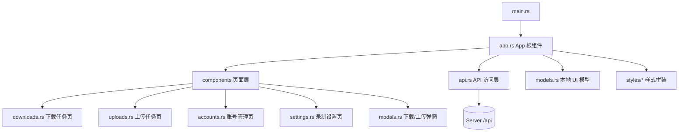
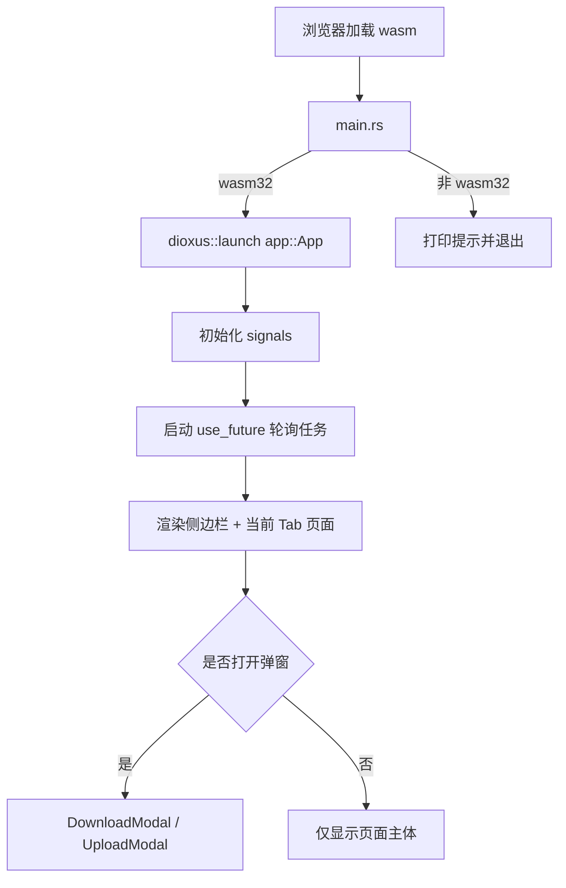
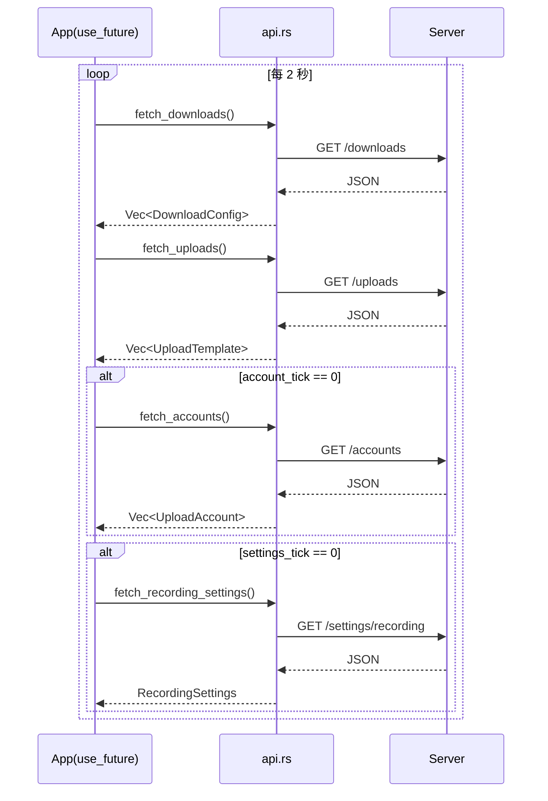
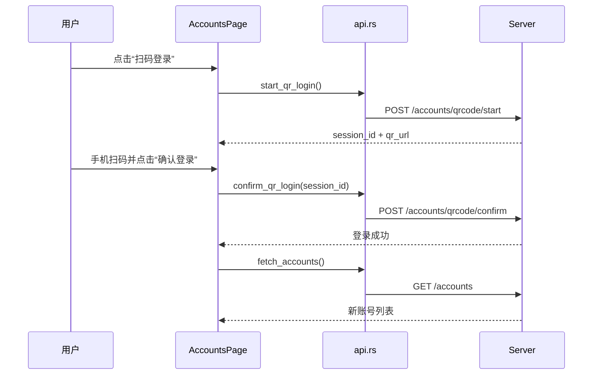
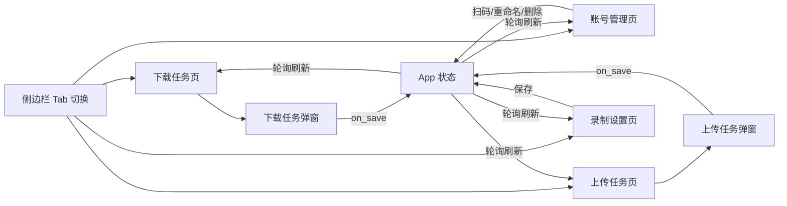

# Web 前端流程与逻辑说明（OmniStream）

本文档说明 `web/` 前端在运行时的核心流程、状态管理和与后端 API 的交互逻辑。

## 1. 模块分层

对应文件：
- 入口：`web/src/main.rs`
- 根组件：`web/src/app.rs`
- API：`web/src/api.rs`
- 页面组件：`web/src/components/*.rs`
- UI 模型：`web/src/models.rs`
- 样式：`web/src/styles/*.rs`

## 2. 启动与渲染流程

说明：
- `main.rs` 使用 `cfg(target_arch = "wasm32")`，保证非 wasm 目标不会编译整套前端模块。
- `App` 中通过多个 `Signal` 管理页面状态和弹窗状态。

## 3. 全局状态与轮询策略

`App` 维护的核心状态（`web/src/app.rs`）：
- `active_tab`: 当前选中的左侧 Tab（下载/账号/上传/设置）
- `data`: `AppData`，包含 downloads / uploads / accounts / recording_settings
- `editing_download`: 下载任务弹窗状态
- `editing_upload`: 上传任务弹窗状态
- `qr_session`, `qr_message`: 扫码登录流程状态

轮询策略：
- 轮询间隔：2 秒
- 每轮必拉：`downloads`, `uploads`
- 每 10 轮拉一次：`accounts`, `recording_settings`

## 4. API 调用逻辑与容错

`web/src/api.rs` 关键设计：
- `join_url(base, path)`：统一拼接 URL
- `api_bases(api_url)`：
  - 主地址使用 `api_url`
  - 若是相对地址且在 wasm 下可获取 `window.location.origin`，追加同源 `/api` 兜底
- 大多数写操作（保存/删除）采用“尝试多个 base，成功即退出”的方式
- 扫码登录接口会返回详细错误字符串（含 endpoint + status）

常用接口映射：
- 下载任务：`GET/POST /downloads`, `DELETE /downloads/{id}`
- 上传任务：`GET/POST /uploads`, `DELETE /uploads/{id}`
- 账号管理：
  - `GET /accounts`
  - `POST /accounts/qrcode/start`
  - `POST /accounts/qrcode/confirm`
  - `POST /accounts/rename`
  - `POST /accounts/delete`
- 录制设置：`GET/POST /settings/recording`

## 5. 页面行为逻辑

### 5.1 下载任务页（Downloads）

能力：
- 搜索、排序、单项编辑删除
- 批量选择、批量删除
- 批量绑定上传任务
- 显示任务当前状态（来自 `current_status`）

保存入口：`DownloadModal`（`web/src/components/modals.rs`）
- 支持任务级录制设置开关：
  - `use_custom_recording_settings = false` 时沿用全局设置
  - `true` 时保存 `recording_settings`

### 5.2 上传任务页（Uploads）

能力：
- 搜索、排序、单项编辑删除、批量删除
- 展示账号、标题、分区、简介、标签

保存入口：`UploadModal`
- 校验：任务名、标题模板、分区、账号必填
- 标题支持占位符：`{title}`、`%Y-%m-%d`、`%H:%M`

### 5.3 账号管理页（Accounts）

能力：
- 发起扫码登录
- 确认登录并刷新账号列表
- 重命名、删除账号

### 5.4 录制设置页（Settings）

能力：
- 设置分片大小/时长
- 设置各平台画质（下拉）
- 设置上传后自动清理本地录制文件

保存时组装 `RecordingSettings` 并调用 `POST /settings/recording`。

## 6. 组件交互总览

## 7. 设计要点与边界

- 前端采用“轻状态 + 高频轮询”模型，逻辑简单直观，避免 websocket 复杂度。
- 写操作后通常依赖下一轮轮询刷新；批量操作处会主动拉取一次减少延迟。
- API 层包含同源兜底能力，适配不同部署方式。
- 当前没有复杂的全局状态库（如 Redux），依赖 Dioxus signals 即可满足需求。

## 8. 维护建议

- 若后续任务量变大，可将轮询拆成按 Tab 激活（仅拉当前页数据）。
- 若要更实时状态（下载进度、上传进度），建议引入 SSE/WebSocket。
- 可为 `api.rs` 增加统一错误结构，避免页面层拼接字符串。
